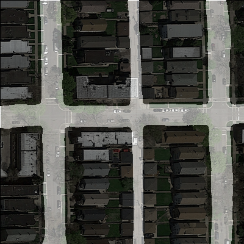
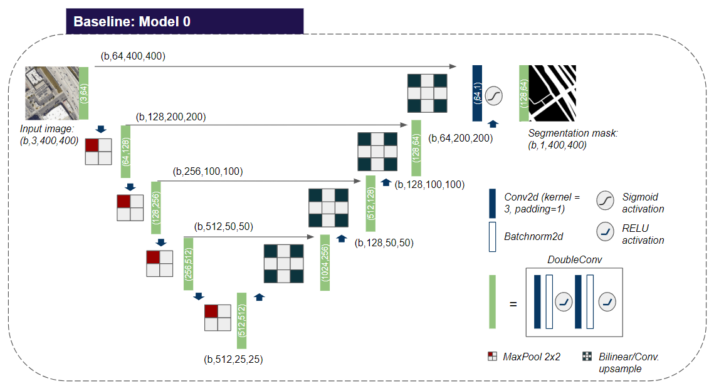
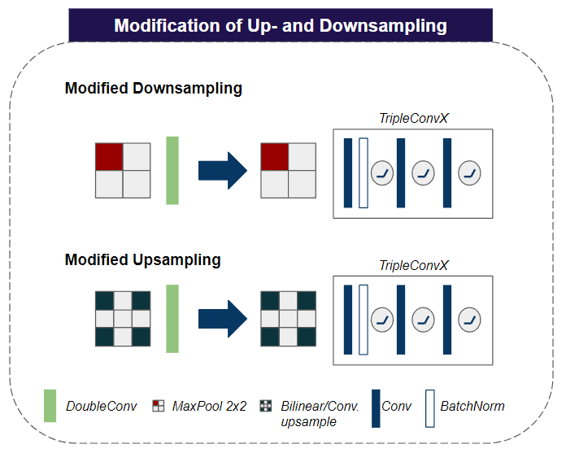
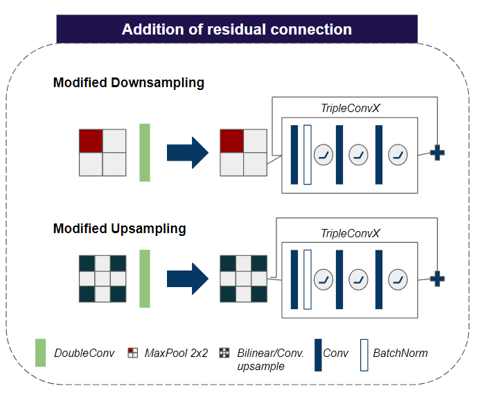
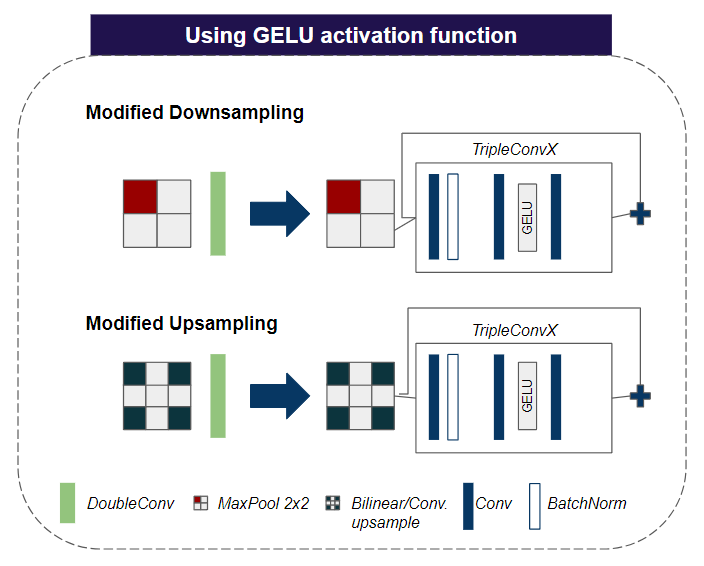
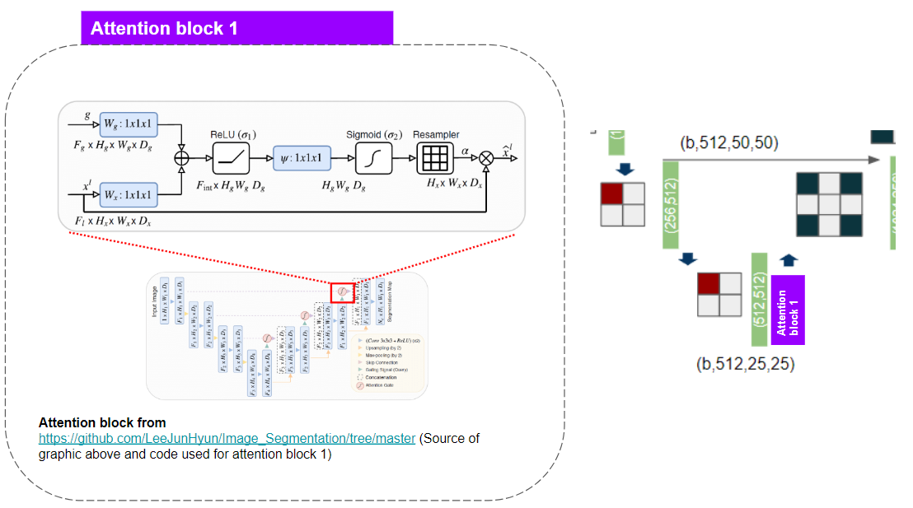
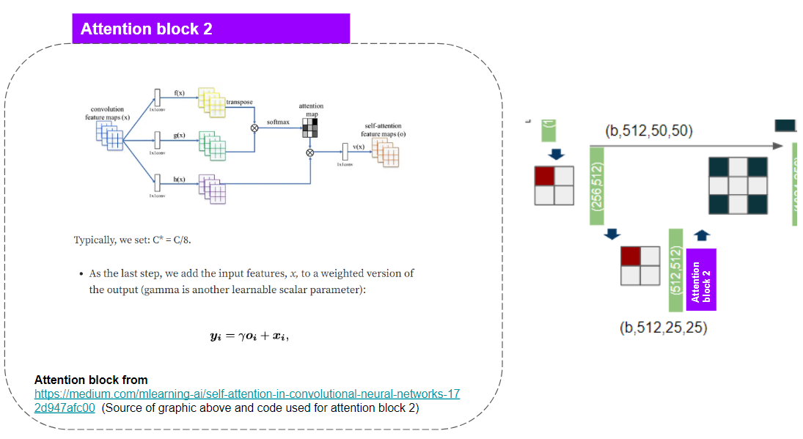
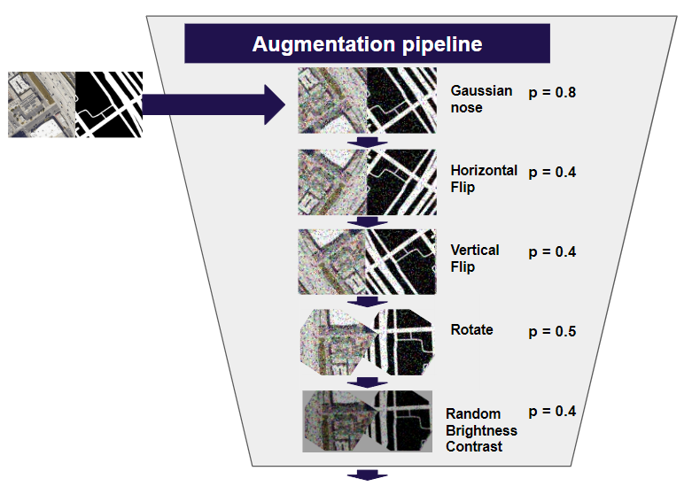

# Computational Intelligence Lab ETHZ 2023
<p align="center">
  
</p>

## Getting Started
#### 1. Create a virtual environment
```console
virtualenv --python="/usr/bin/python3.10" env
```
#### 2. Activate the virtual environment: 
```console
source env/bin/activate
```
#### 3. Install the dependencies: 
```console
pip install -r requirements.txt
```

#### 4. Specify hyperparameters: 
Adjust settings of your run in `configs/config.yml`

#### 5. Download training data:
Download .zip file from https://drive.google.com/file/d/1LFccNgHULMijl0PS_3q74s1SWFC7tGYf. Extract the file
in the `data` directory. The three folders `test_set_images`, `training` and `valid` should be direct 
subfolders of `data`.

### Training a model
To train a model, make sure that you import the right model file in the top of main.py (e.g. from model0 import), make sure the parameters in configs/config.yml are as desired and then run:
```console
python main.py
```
from your virtual environment. Checkpoints will be saved to the output folder under the experiment name you specified. Additionally wandb logging allows to track your experiments. As the Bayesian models require different training pipelines, they use separate scripts `main_Bayesian.py` and `main_Bayesian2.py`.

### Creating submissions
To create a submission, go to the create_submission.py, check that you import the right model file in the top of create_submission.py (e.g. from model0 import), enter the respective checkpoint to load in configs/config.yml and then run: 
```console
python create_submission.py
```

Note that the Bayesian models have their own versions of main/create_submission but work the same way. 

### Dependencies
* The code in this repository has been tested for Ubuntu 22.04, Python3.10 and torch 2.0.1


## Models and Methodology:
This repository contains the accompanying implementation for our paper "Towards an optimized U-Net for semantic segmentation of aerial road images". This includes all models presented, augmentation techniques applied as well as wandb based logging.

### Model 0:
<p align="center">
  
</p>
Model 0 is a standard U-Net implementation as proposed in the original paper (cf. https://arxiv.org/abs/1505.04597). It served as thge starting point for our implemented adaptations.

### Model 1:
<p align="center">
  
</p>
Model 1 replaces the double convolutions from model0 with ResNext-inspired triple convolutions.

### Model 2:
<p align="center">
  
</p>
Model 2 adds skip connection to the upsampling and downsampling blocks.

### Model 3:
<p align="center">
  
</p>
Model 3 uses one GeLU instead of three ReLU activation functions in the triple convolution blocks.

### Attention 1:
<p align="center">
  
</p>
Uses one attention block taken unmodified from https://github.com/LeeJunHyun/Image_Segmentation/tree/master after the bottleneck.

### Attention 2:
<p align="center">
  
</p>
Uses one attention block taken unmodified from https://medium.com/mlearning-ai/self-attention-in-convolutional-neural-networks-172d947afc00 after the bottleneck.

### BAYESIAN 1:
Using MC-Dropout to be able to make an ensemble out of one model.

### BAYESIAN 2:
Using MC-Dropout to be able to make an ensemble out of one model and gets uncertainties from a BAYESIAN 1 model as extra input.

### Datasets used:
All data used for training is already part of the repository. To change the data used simply adit train_list.txt and val_list.txt to point to your new data pathes. We used two sources for our dataset:<br />  


* 144 images from ETHZ road segmentation challenge taken from: https://www.kaggle.com/competitions/ethz-cil-road-segmentation-2023/data

* 100 images from EPFL road segmentation challenge taken from: https://github.com/LiangzeJiang/Aerial-Road-Segmentation

### Augmentations used:
<p align="center">
  
</p>

## Results
The results for training our models can be retrieved under the following wandb links: 
* Model 0: https://wandb.ai/cillab/learners-public/runs/nv94wo1v
* Model 1: https://wandb.ai/cillab/learners-public/runs/2tzffnh5
* Model 2: https://wandb.ai/cillab/learners-public/runs/3bb65lmh
* Model 3: https://wandb.ai/cillab/learners-public/runs/kdr3x6dc
* Model 1 + att1: https://wandb.ai/cillab/learners-public/runs/o3g67goq
* Model 1 + att2: https://wandb.ai/cillab/learners-public/runs/binevffh
* Model 3 + att1: https://wandb.ai/cillab/learners-public/runs/c9d1ffha
* Model 3 + att2: https://wandb.ai/cillab/learners-public/runs/inkuvzhj
* attention.py: https://wandb.ai/cillab/road_segmentation/runs/7ibvb6fk
* BAYESIAN m1: https://wandb.ai/cillab/road_segmentation/runs/0o2aqtmu
* BAYESIAN m2: https://wandb.ai/cillab/learners-public/runs/bu5bkrkh

## Acknowledgments  
Sources:
* Code skeleton based on: https://github.com/yl4579/StarGANv2-VC
* Current Unet taken from:  https://github.com/milesial/Pytorch-UNet/tree/master/unet
* Dice loss taken from: https://gist.github.com/weiliu620/52d140b22685cf9552da4899e2160183
* Data taken from: https://github.com/LiangzeJiang/Aerial-Road-Segmentation
* Attention U-net https://github.com/LeeJunHyun/Image_Segmentation/tree/master
* this repo has been cloned and made public


